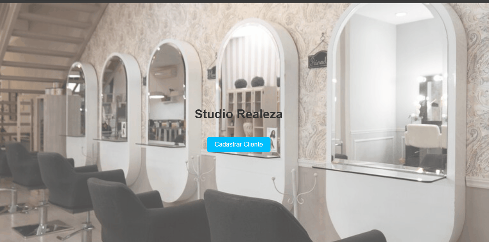

<p align="center">
   
</p>

<p align="right">
   
</p>

<h1 align="center">Studio Realeza - Client Management System</h1>

<p align="center">
  
  
  
  
  
   
</p>
<hr>

<p align="center">This project is a simple client management system that allows adding, editing, and deleting client details.</p>

<p align="center">
  <a href="#dart-about">About</a> &#xa0; | &#xa0; 
  <a href="#sparkles-features">Features</a> &#xa0; | &#xa0;
  <a href="#rocket-technologies">Technologies</a> &#xa0; | &#xa0;
  <a href="#white_check_mark-requirements">Requirements</a> &#xa0; | &#xa0;
  <a href="#checkered_flag-starting">Starting</a> &#xa0; | &#xa0;
  <a href="#memo-license">License</a> &#xa0; | &#xa0;
  <a href="https://github.com/agostinhomarcia" target="_blank">Author</a>&#xa0; | &#xa0
  <a href="#" target="_blank" rel="noopener noreferrer">Project</a>
</p>

<br>

## :dart: About

<h4 align="center">Studio Realeza - Client Management System</h4>

<p align="center">
   
</p>

## :sparkles: Features

:heavy_check_mark: Add and manage client details;\
:heavy_check_mark: Edit existing client information;\
:heavy_check_mark: Delete clients from the database;

## :rocket: Technologies

The project uses the following technologies:

- [HTML](https://developer.mozilla.org/pt-BR/docs/Web/HTML/Element/html/)
- [CSS](https://developer.mozilla.org/pt-BR/docs/Web/CSS)
- [JavaScript](https://developer.mozilla.org/pt-BR/docs/Web/JavaScript)

## :white_check_mark: Requirements

Before starting, make sure you have [Git](https://git-scm.com) and [Node.js](https://nodejs.org/en/) installed.

## :checkered_flag: Starting

```bash
# Clone this project
$ git clone https://github.com/agostinhomarcia/my-To-do-list.git

# Access the project folder
$ cd my-To-do-list

# The server will initialize at http://localhost:3000


```

:memo: License
This project is under the MIT license.

Made with love by Márcia Agostinho 🚀.

<p align="center">
  
</p>

<a href="#top">Back to top </a>
